## Observations and Calculations

#### Generate the data for different *r* values, & then plot​ *x<sub>n</sub>* vs *n* for those ​*r* ​ values

We plot the time series plots for different values of ​*r*, i.e. for values of ​ *r* equal to one of ​ *2.8, 3, 3.3, 3.449, 3.5, 3.54409, 3.6445, 3.9* ​ and compare the plots.

*NOTE*: Initial value is taken as ​ x<sub>0</sub> = 0.1

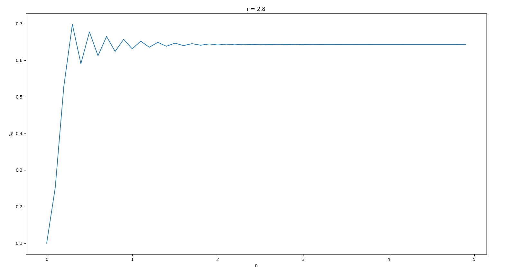
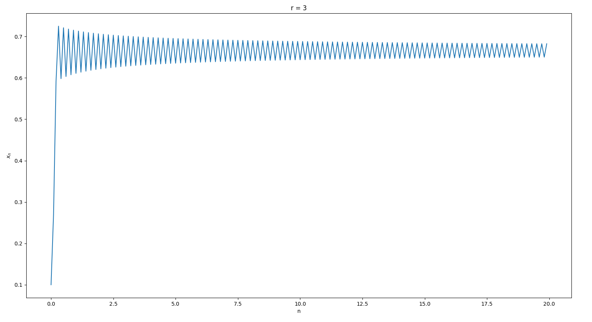
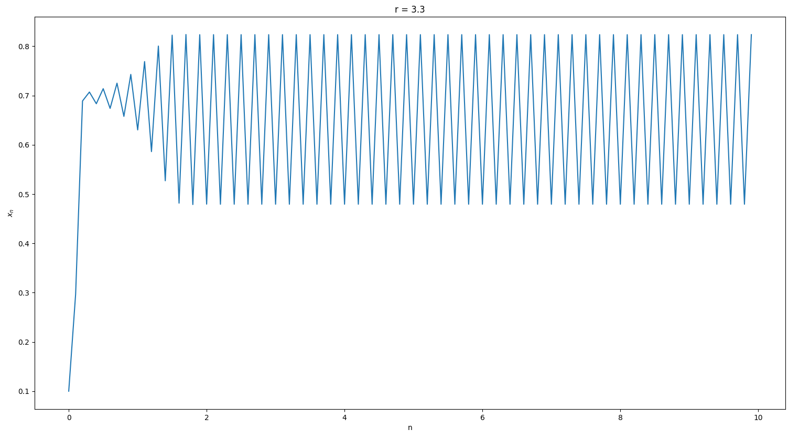
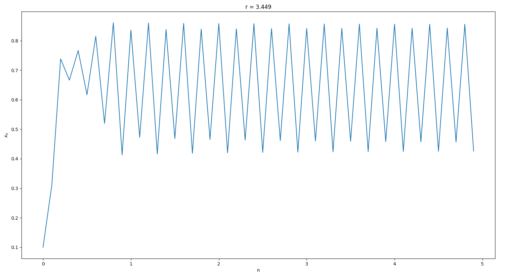
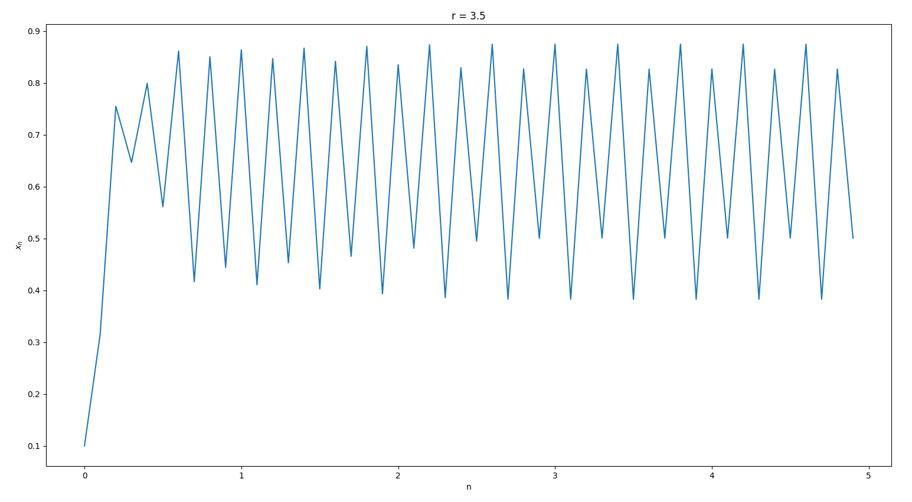
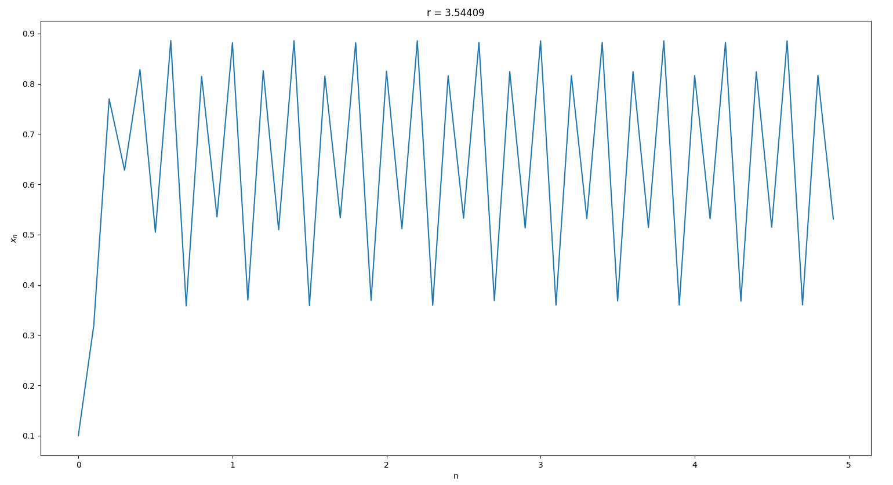
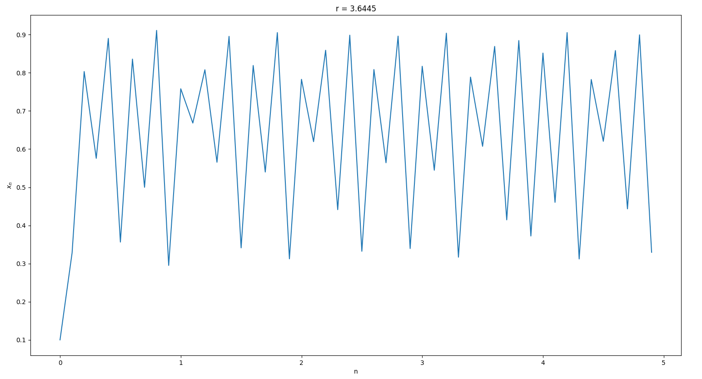
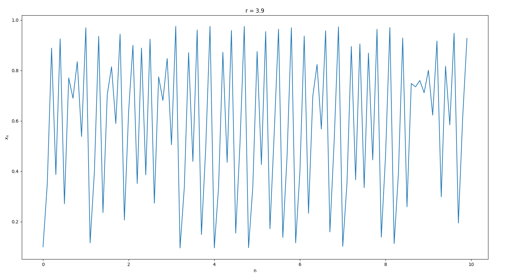

From these plots, we can observe that:   

● If ​*r* ​is between ​*1* ​and ​*3* (for example, *r =​ 2.8*​), the population eventually settles at some steady-state value. Although the population may wobble a bit over short time spans, the long-term behavior after many iterations is for the system to settle on one population size.  
● I​f we let ​ *r = 3*, we see a surprising change in the system's behavior. Instead of settling on one value, the population oscillates between two different values forever. This change in behavior is a ​ bifurcation​ from steady-state values to oscillations of period 2​. We say "​*period 2*" because it takes two iterations to return to the original value.    
● As ​*r* increases beyond ​*3*, more interesting behavior emerges. We start to see more bifurcations, and they become more frequent. Each time, the period of oscillation doubles.      
● The population oscillates first with period ​*2*​ when​ *r = 3*. When ​ *r = 3.449*,​ the period doubles to period *4*, indicating that it now takes four iterations for the population to return to a value that it has had before. The period continues to double from *4* to​ *8* to ​*16*, ​each time at a successively smaller increment of increase in  *r*. ​Eventually, when ​*r = 3.569946*​, the period becomes ​ infinite​. This means that the population fluctuates wildly, never regularly returning to any previous value.


#### Plot the time-series plot for a value of *r* given by *r = 3.857084*. Compare the time-series plots you get with slight changes in ​ *r*. See how a small change in the control parameter can completely change the evolution of the system.

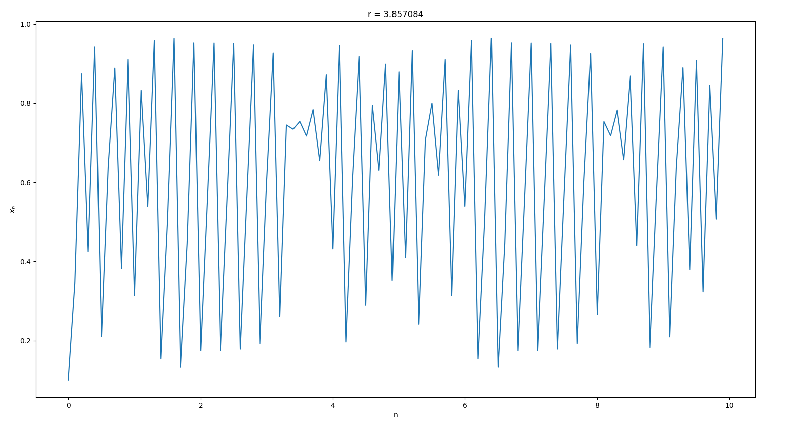
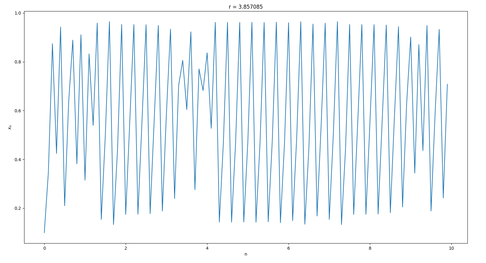
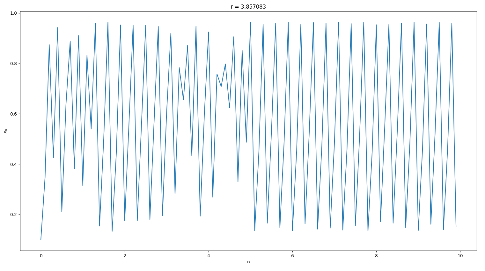

In these last 3 cases, i.e for ​*r = 3.857084, r = 3.857083 ​ and ​ r = 3.857085*, corresponding plots of ​ *x<sub>n</sub>* ​ changes drastically, and there seems no proper way to determine any r​elation and predict the plot of ​ *x<sub>n</sub>* for infinitesimal changes in ​ *r*.


#### Plot what is known as the "orbit diagram" or "bifurcation diagram" for the logistic map -- *x* vs *r* -- i.e. all possible *x* values that can be reached for eac​h *r* value, *r* running from *1* to *4*

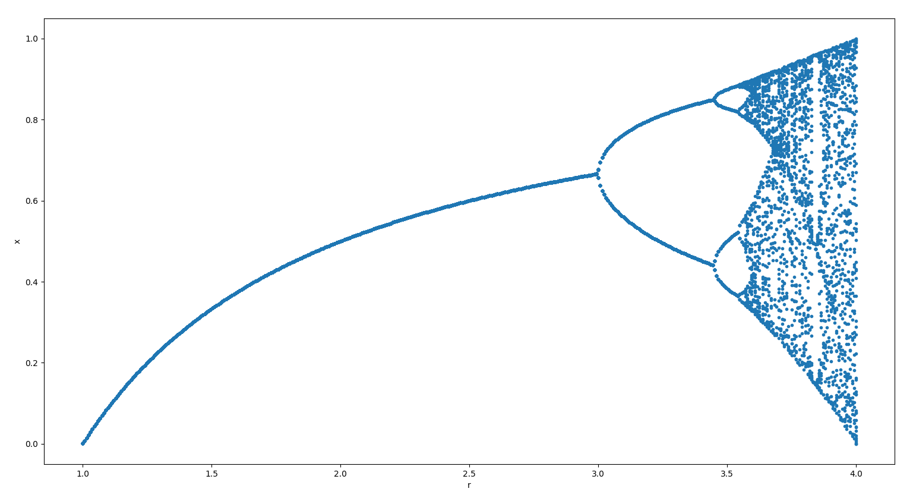
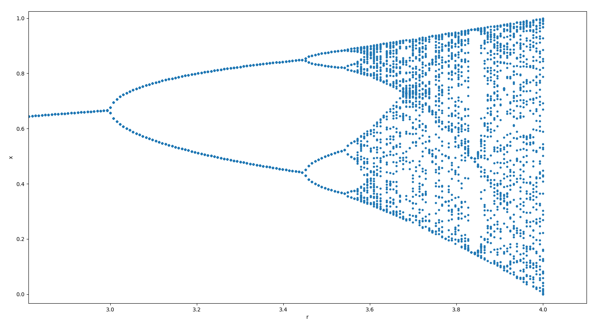

#### Calculate the value of the Feigenbaum constants

To find the values of the Feigenbaum constants, we find different values for different successive bifurcations.

For example, we first find the Feigenbaum constant for the difference between the 1st ​and the ​2nd ​bifurcations, then for the difference between the 2nd ​ and the 3rd​ bifurcations, and so on...

The final values are as shown here, output of the Python program (which can be run by ​ `python four.py`) to calculate the same:
```
$ python four.py

 Bifurcation #       Feigenbaum constant
      2                    3.21851142
      3                    4.38567760
      4                    4.60094928
      5                    4.65513050
      6                    4.66611195
      7                    4.66854858
      8                    4.66906066
      9                    4.66917155
     10                    4.66919515
     11                    4.66920026
     12                    4.66920098
     13                    4.66920537
```

From the above screenshot, we can see that as we go further down the bifurcations, the Feigenbaum constant’s value is tending to converge towards the value ​ *4.69920537*, which is very similar to the theoretical value, *4.6692016*.
